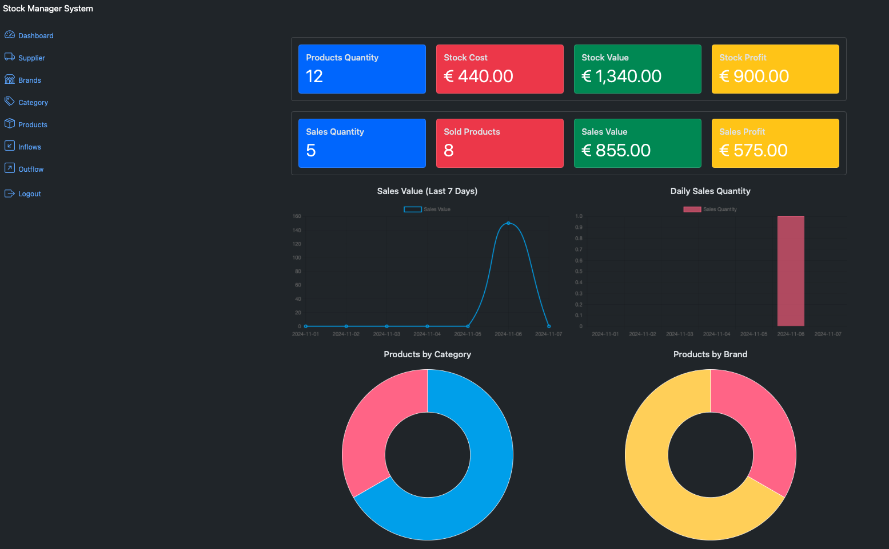
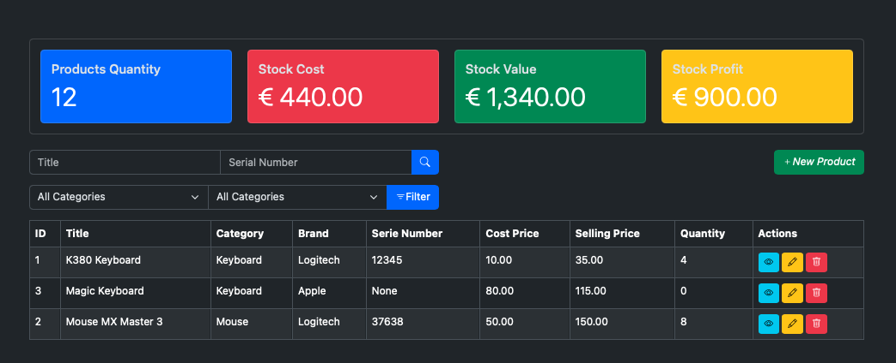

# SGE - Stock Management System

## Overview

This project is a web application built using Django. It includes functionalities for managing products, categories,
brands, suppliers, inflows, and outflows. The application also provides various metrics and charts to visualize data.




## Features

- User authentication and authorization
- Product management
- Category management
- Brand management
- Supplier management
- Inflow and outflow management
- Data visualization with charts

## Technologies Used

- Python
- Django
- HTML
- CSS
- JavaScript
- Chart.js

## Installation

1. Clone the repository:
    ```bash
    git clone https://github.com/BrunaMello/sge.git
    cd sge
    ```

2. Create a virtual environment and activate it:
    ```bash
    python -m venv venv
    source venv/bin/activate  # On Windows use `venv\Scripts\activate`
    ```

3. Install the required packages:
    ```bash
    pip install -r requirements.txt
    ```

4. Apply migrations:
    ```bash
    python manage.py migrate
    ```

5. Create a superuser:
    ```bash
    python manage.py createsuperuser
    ```

6. Run the development server:
    ```bash
    python manage.py runserver
    ```

7. Open your browser and go to `http://localhost:8000/`.

## Usage

- Log in with your superuser account.
- Navigate through the different sections to manage products, categories, brands, suppliers, inflows, and outflows.
- Use the provided charts to visualize data.

## Contributing

1. Fork the repository.
2. Create a new branch (`git checkout -b feature-branch`).
3. Make your changes.
4. Commit your changes (`git commit -am 'Add new feature'`).
5. Push to the branch (`git push origin feature-branch`).
6. Create a new Pull Request.

## License

This project is licensed under the MIT License. See the `LICENSE` file for more details.